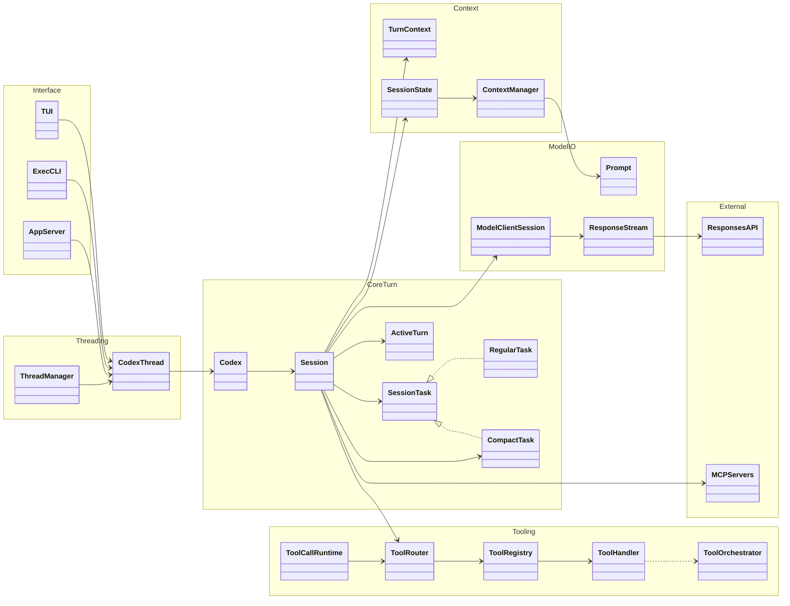
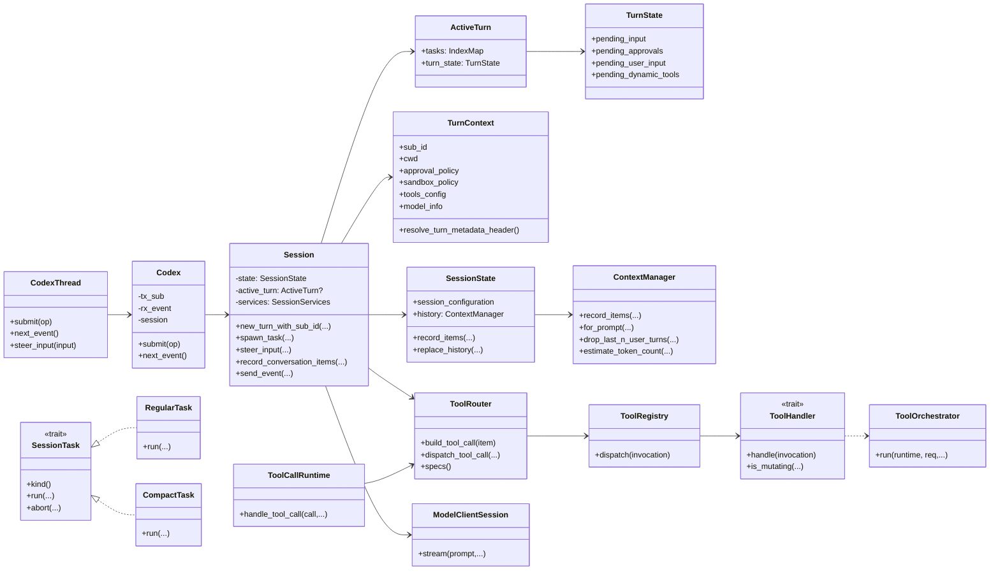
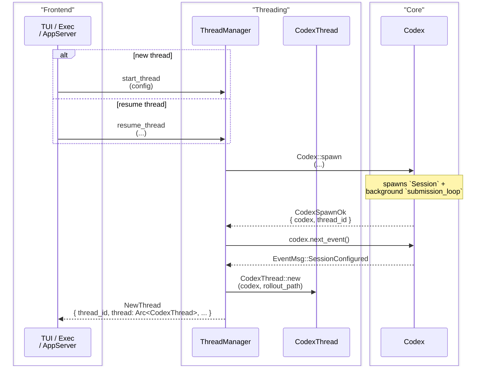
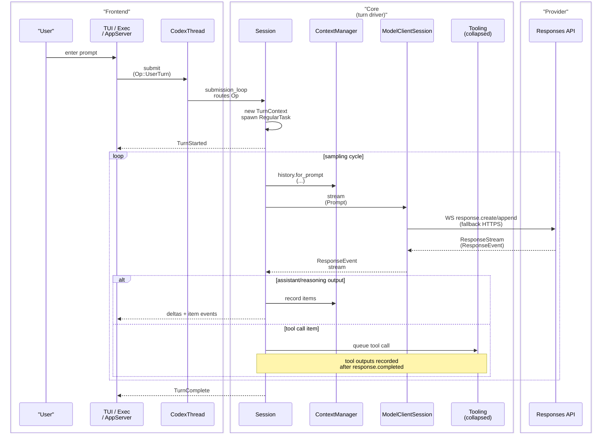
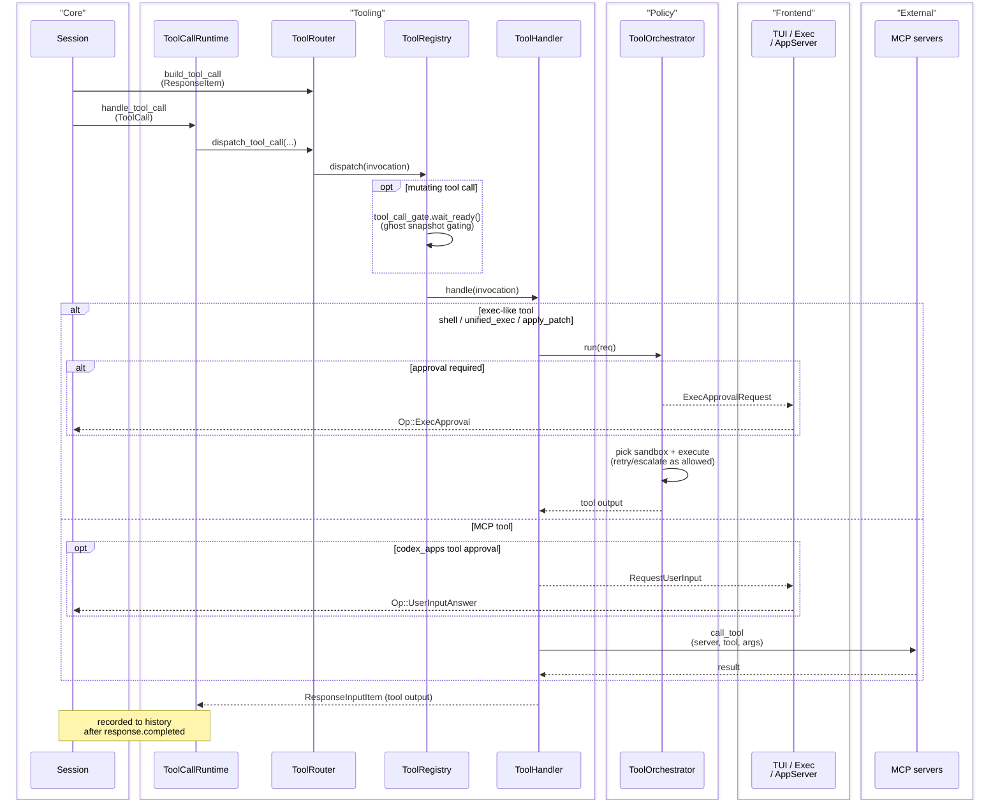
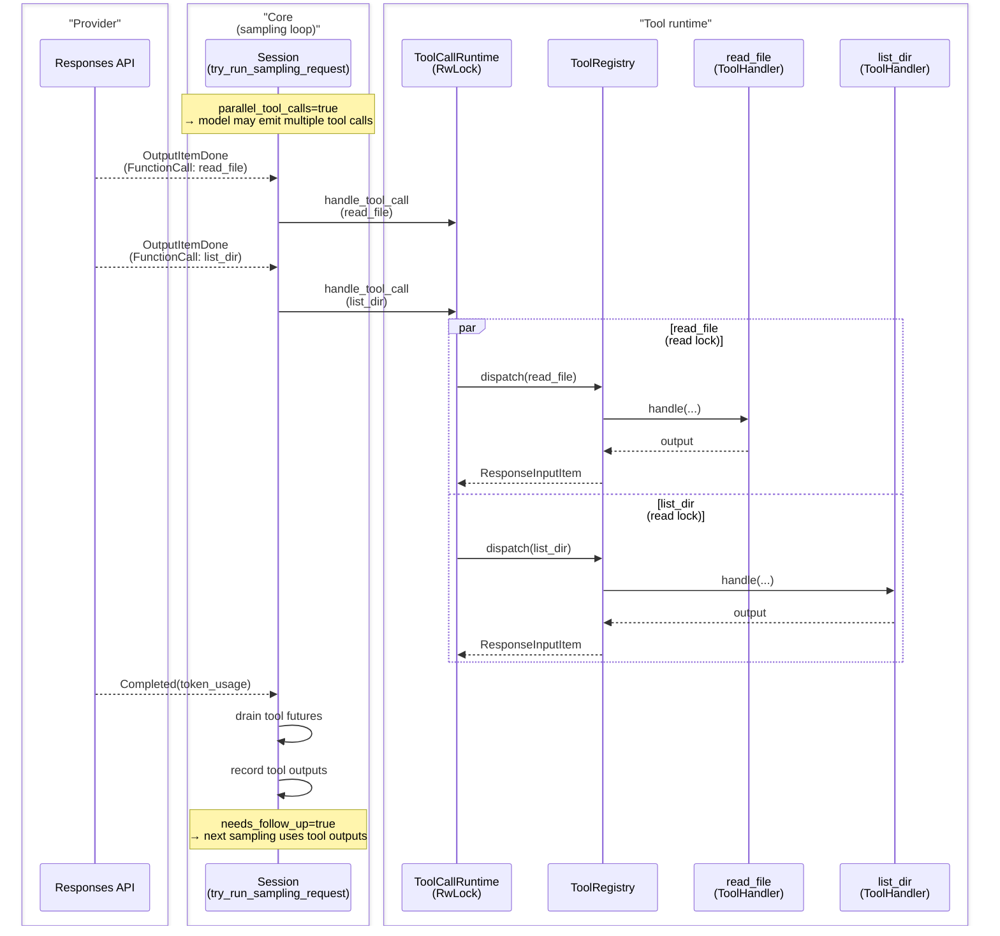
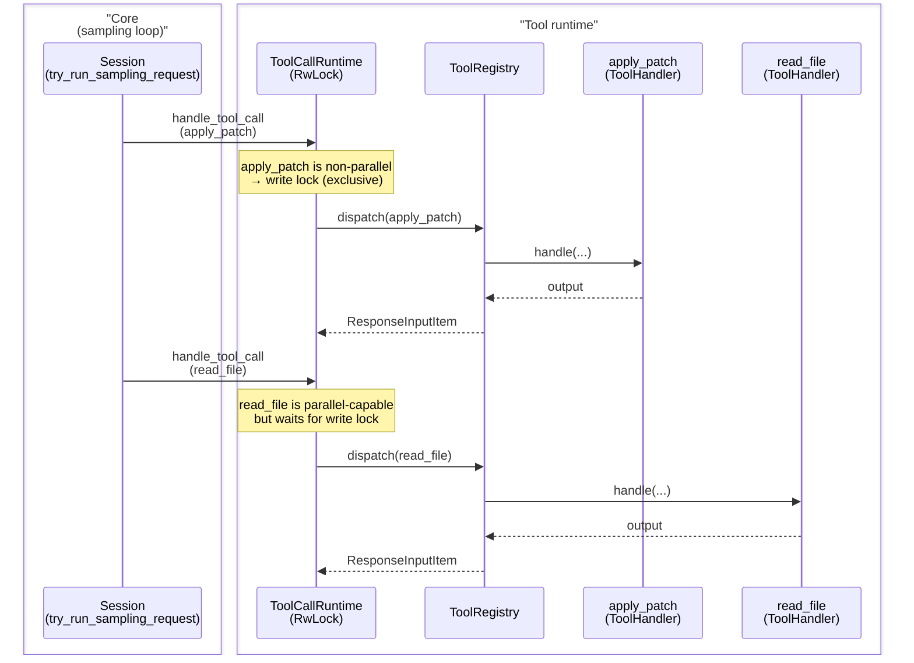
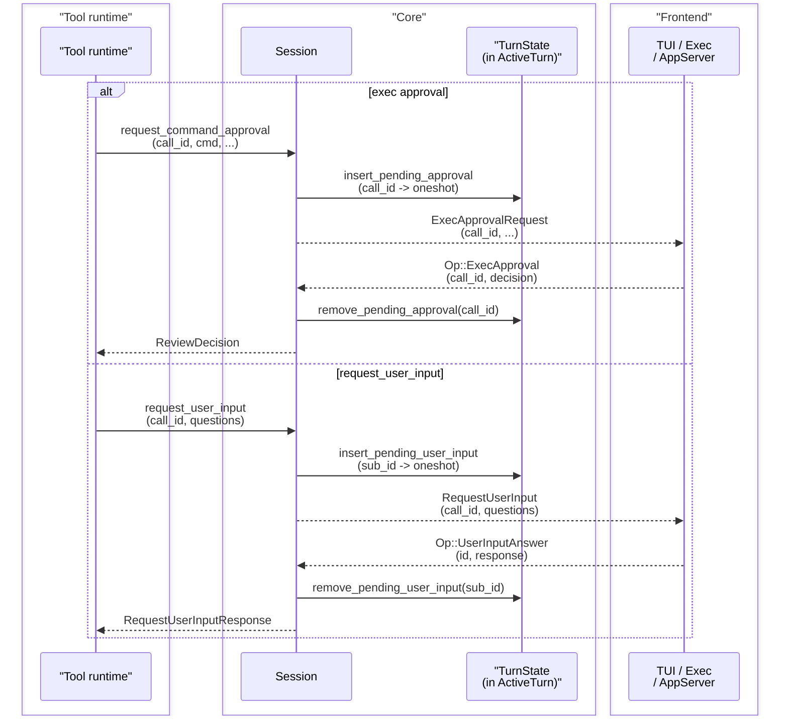

# Codex-rs Agent System Design (Prompt, Context, Tool Orchestration)

## `arch-pattern`
- Event-driven actor model with explicit command/event queues (`Submission`/`Event`).
- Turn-oriented state machine where each user turn runs as a cancellable session task.
- Layered tool pipeline (`ToolCallRuntime` -> `ToolRouter` -> `ToolRegistry` -> tool handlers; exec-like handlers use `ToolOrchestrator`) with approval+sandbox policy enforcement.

## Scope
This document focuses on `extern/tracked/codex/codex-rs` internals for:
- how user prompts become model turns,
- how model-visible context is built/maintained/compacted,
- how tool calls are routed, approved, sandboxed, executed, and fed back to the model.

## Package Diagram

## Class Diagram

## Class Responsibilities

This section is intentionally "why it exists" oriented (not an exhaustive API reference). Each entry includes a small concrete example.

### Threading / Public API

| Class | Role | Key responsibilities (what it owns/does) | Simple example |
| --- | --- | --- | --- |
| `ThreadManager` | Create/resume/fork threads and keep a live registry. | Build shared services (`AuthManager`, `ModelsManager`, `SkillsManager`, file watcher). Maintain `ThreadId -> Arc<CodexThread>` map. Spawn new threads (`Codex::spawn`) and return `NewThread` (first event must be `SessionConfigured`). | App server calls `start_thread(config)` → receives `NewThread { thread_id, thread, session_configured }` and stores the `Arc<CodexThread>` in its session map. |
| `CodexThread` | Public handle for one thread (conversation). | Frontends call `submit(Op)` to drive the thread. Frontends call `next_event()` to receive protocol events (single ordered stream). Supports `steer_input(...)` to buffer extra user input into the currently running turn. | TUI sends `Op::UserTurn` then reads `next_event()` until it sees `EventMsg::TurnComplete { turn_id, .. }`. |
| `Codex` | Internal queue-pair + background submission loop. | Owns `tx_sub` (submissions in) + `rx_event` (events out). Runs `submission_loop` that routes `Op`s into session behavior. Bridges between a `CodexThread` API and the live `Session`. | `CodexThread.submit(op)` ≈ "push onto submissions channel"; `CodexThread.next_event()` ≈ "pop the next event produced by the session loop". |

### Turn execution

| Class | Role | Key responsibilities (what it owns/does) | Simple example |
| --- | --- | --- | --- |
| `Session` | Coordinator for a single thread’s lifecycle. | Create `TurnContext` snapshots (`new_turn_with_sub_id`). Spawn/abort tasks (only one active turn at a time). Record history + rollout items; emit events (`TurnStarted`, deltas, approvals, `TurnComplete`, …). Hosts "waiter" APIs used by tool runtimes (`request_command_approval`, `request_user_input`, …). | `Op::UserTurn` arrives → try `steer_input`; if no active turn, record settings-update items then `spawn_task(..., RegularTask)` to run `run_turn`. |
| `SessionState` | Mutex-guarded session-scoped data. | Holds `SessionConfiguration`, `ContextManager`, token usage + rate limits, MCP selection + dependency prompts, etc. Central place where stream completion updates token/rate-limit snapshots. | `ResponseEvent::Completed { token_usage }` → update token info and send `EventMsg::TokenCount` so the UI can update counters. |
| `TurnContext` | Immutable per-turn snapshot of settings + policies. | Stores `sub_id`, `cwd`, model/provider info, approval/sandbox policy, tools config, truncation policy, dynamic tools, etc. Exposes helpers like `resolve_path(...)` and `resolve_turn_metadata_header()`. Provides `tool_call_gate` readiness so mutating tools can be delayed until the ghost snapshot is captured. | `shell` tool gets `workdir: "subdir"` → uses `turn_context.resolve_path(Some("subdir"))` to run under the session cwd, not the process cwd. |
| `ActiveTurn` | Bookkeeping for the currently running turn. | Tracks running `SessionTask`s (usually 1) keyed by turn id (`sub_id`). Provides shared `turn_state` used to coordinate approvals/user-input/dynamic tool responses and buffered input. | When a task ends, `Session::on_task_finished` removes it from `ActiveTurn.tasks`, drains buffered `pending_input`, and emits `TurnComplete`. |
| `TurnState` | In-flight waiters + buffered input for one turn. | Stores pending approvals (`pending_approvals`), pending `request_user_input` answers, pending dynamic tool responses, and buffered `pending_input` items to be injected on the next sampling request. | A command needs approval → `Session::request_command_approval` stores a oneshot in `pending_approvals` and emits `ExecApprovalRequest`; UI responds via `Op::ExecApproval` and the tool runtime unblocks. |

### Context / history

| Class | Role | Key responsibilities (what it owns/does) | Simple example |
| --- | --- | --- | --- |
| `ContextManager` | Model-visible transcript store + token heuristics. | Records model-visible `ResponseItem`s (drops non-API items; truncates tool outputs per `TruncationPolicy`). Builds prompt input (`for_prompt(...)`) by normalizing call/output pairs and stripping unsupported images; ghost snapshots are not sent to the model. Supports rollback helpers like `drop_last_n_user_turns`. | `read_file` returns 5MB text → when recorded it is truncated, so the next `Prompt` build stays within serialization/token budgets. |

### Model I/O

| Class | Role | Key responsibilities (what it owns/does) | Simple example |
| --- | --- | --- | --- |
| `Prompt` | One sampling request payload. | Holds prompt `input` (history), tool specs, `parallel_tool_calls` flag, base instructions + optional personality, and optional output JSON schema. Constructed for each sampling request from `history.for_prompt(...)` + current tool selection. | Follow-up sampling request after a tool output uses a newly built `Prompt` so it includes the just-recorded tool output item. |
| `ModelClientSession` | Turn-scoped transport state to the model provider. | Prefer WebSocket transport; fall back to HTTPS streaming when needed. Maintain per-turn "sticky routing" (`x-codex-turn-state`) and last-request state so `response.append` is used only when safe within the same turn. Exposes `stream(...) -> ResponseStream`. | One turn requires multiple sampling requests (tool follow-ups) → reuse the same `ModelClientSession` so sticky routing and incremental appends stay valid. |
| `ResponseStream` | Streaming sequence of `ResponseEvent`s. | `Stream<Item = Result<ResponseEvent>>` produced by `ModelClientSession::stream`. Consumed by the sampling loop to emit deltas/items, queue tool futures, and finally update token usage on `Completed`. | The loop processes `OutputTextDelta` (UI deltas), `OutputItemDone` (record + maybe tool call), then `Completed { token_usage }` (finalize). |

### Tools

| Class | Role | Key responsibilities (what it owns/does) | Simple example |
| --- | --- | --- | --- |
| `ToolRouter` | Parse tool calls + provide tool specs. | Build tool specs for the model prompt (`specs`). Convert `ResponseItem` → typed `ToolCall` (`build_tool_call`) including MCP parsing and `LocalShellCall` handling. Dispatch a `ToolCall` through `ToolRegistry`. | Model emits `mcp__codex_apps__calendar_create_event` → router routes it to MCP invocation `{server, tool, raw_arguments}` (not a normal function tool). |
| `ToolCallRuntime` | Execute tool calls with concurrency control. | Enforce per-tool parallelism via read/write lock (parallel tools share read lock; serialized tools take write lock). Run tool calls asynchronously and respect turn cancellation. | Two `read_file` calls can run concurrently; a `shell` call is serialized and blocks other tools until it completes. |
| `ToolRegistry` | Handler lookup + invariants + gating. | Lookup handler by tool name; validate handler kind vs payload type. If handler says the call is mutating, wait for `turn_context.tool_call_gate` readiness (ghost snapshot gating). Convert handler output into a `ResponseInputItem` to be recorded as a tool output item. | `apply_patch` is mutating → registry waits for ghost snapshot readiness so `undo` has a reliable "before" state. |
| `ToolHandler` (trait) | Implement one tool. | `kind()` + `matches_kind(...)` to assert payload compatibility. `is_mutating(...)` to declare whether gating should apply. `handle(invocation)` to produce a tool output. | `ShellHandler` parses JSON args, emits begin/finish events, and delegates policy mechanics to `ToolOrchestrator`. |
| `ToolOrchestrator` | Central approvals + sandbox selection + retry semantics (exec-like runtimes). | Determine approval requirement (policy + execpolicy-derived requirement). Select initial sandbox; on sandbox denial, optionally prompt and retry unsandboxed when allowed. Support per-session caching via `with_cached_approval` (notably multi-target approvals like `apply_patch`). | Command denied by sandbox → orchestrator prompts "command failed; retry without sandbox?" and reruns without sandbox if approved. |

### Tasks

| Class | Role | Key responsibilities (what it owns/does) | Simple example |
| --- | --- | --- | --- |
| `SessionTask` (trait) | Pluggable "turn driver" behavior. | Identify itself via `kind()` (regular/compact/review/etc). Drive work via `run(...)` and optionally clean up in `abort(...)` after cancellation. | `RegularTask` drives normal chat; `CompactTask` drives compaction without running the normal sampling loop. |
| `RegularTask` | Default user turn driver. | Runs `run_turn` (sampling loop): build prompt → stream → queue tools → follow up until stable completion. | User asks "list files" → model calls `shell` → tool output recorded → follow-up sampling request returns final answer. |
| `CompactTask` | Compaction driver. | Runs compaction (local or remote depending on provider) and rewrites history to "initial context + recent user turns + summary". | Token usage crosses model’s auto-compact threshold → session runs a compaction turn and then continues the thread with a shorter transcript. |

## Sequence Diagrams

### 0) Thread creation / resume (high level)

**Steps (what happens):**
1. The frontend asks `ThreadManager` to start a new thread or resume one from rollout/history.
2. `ThreadManager` calls `Codex::spawn(...)`, which creates the internal `Session` and starts the background `submission_loop` that will route future `Op`s.
3. `ThreadManager` waits for the first event (`SessionConfigured`) to learn the initial session metadata (e.g., rollout path).
4. `ThreadManager` wraps the spawned `Codex` into a user-facing `CodexThread` handle and returns `NewThread` to the frontend.

### 1) Turn lifecycle (tooling collapsed)

**Steps (what happens):**
1. The user types a message; the frontend submits an `Op::UserTurn` to the thread (`CodexThread`).
2. The thread’s background `submission_loop` builds a per-turn `TurnContext` and starts a `RegularTask` (the default "drive a turn" task).
3. `Session` emits `TurnStarted` so the UI can show "this turn is running".
4. Each sampling cycle builds a `Prompt` from `ContextManager::for_prompt(...)` and streams a provider response via `ModelClientSession::stream(...)`.
5. As streamed events arrive:
   - assistant text/reasoning is recorded to history and forwarded to the UI as deltas/items,
   - tool calls are detected and queued for execution (details hidden in the `Tooling` box).
6. When the provider response reaches `Completed`, the session records any tool outputs, decides whether a follow-up sampling request is needed, and either loops again or ends the turn with `TurnComplete`.

### 2) Tooling module (expanded)

**Steps (what happens):**
1. A model output item is inspected by `ToolRouter::build_tool_call(...)` to see if it’s a tool call (function call, local shell call, MCP call, etc.).
2. If it is, `ToolCallRuntime` starts running it asynchronously, while enforcing per-tool parallelism rules (some tools can run concurrently; others are serialized).
3. The call is dispatched through `ToolRegistry` to the concrete `ToolHandler` for that tool name.
4. If the handler says the tool might mutate the environment, `ToolRegistry` waits for `tool_call_gate` readiness (so "ghost snapshot"/undo state is captured before mutations).
5. The handler executes the tool:
   - exec-like tools use `ToolOrchestrator` to apply approval + sandbox policy (and possibly retry unsandboxed),
   - MCP tools call out to an external MCP server, optionally prompting the user first (for annotated codex_apps tools).
6. The handler returns a `ResponseInputItem` tool output. The session records that output into history after the provider response completes, which typically triggers the next sampling request ("follow-up") in the same turn.

### 2a) Parallel tool calls (two parallel-capable tools run concurrently)

**Steps (what happens):**
1. The prompt is sent with `parallel_tool_calls=true` (only when the chosen model supports it), which allows the model to request more than one tool call in a single streamed response.
2. As each tool call item arrives (`read_file`, `list_dir`), the session queues execution via `ToolCallRuntime::handle_tool_call(...)`.
3. Because both tools are marked "parallel-capable", `ToolCallRuntime` uses a shared read lock and they run at the same time in separate tasks.
4. Their outputs become `ResponseInputItem`s, which the session records after `ResponseEvent::Completed`.
5. Since tool calls happened, `needs_follow_up=true`, so the next sampling request is made with those tool outputs included in the prompt.

### 2b) When a tool is non-parallel (it serializes other tool calls)

**Steps (what happens):**
1. Some tools are intentionally *not* parallel-capable (e.g., `apply_patch`, `write_stdin`), because they act like "critical sections" that should not overlap with other tool work.
2. When such a tool runs, `ToolCallRuntime` takes the write lock, which blocks other tool executions (even parallel-capable ones) until it finishes.
3. This gives Codex a simple and predictable concurrency model: parallelism is opt-in per tool.

### 3) Approvals + user input waiters (TurnState)

**Steps (what happens):**
1. A running tool needs a decision from the user (approval to run a command, or answers to a question).
2. The tool asks `Session`, and `Session` registers a "waiter" in `TurnState` (implemented as a one-shot channel) so the decision can be delivered back to the correct in-flight call.
3. `Session` emits an event to the frontend (`ExecApprovalRequest` or `RequestUserInput`) and then awaits the one-shot.
4. The frontend renders the prompt and replies with an `Op` (`Op::ExecApproval` or `Op::UserInputAnswer`).
5. `Session` looks up the matching waiter in `TurnState`, completes it, and the tool runtime continues with the user’s decision.

## Prompt-to-Agent Flow
1. UI frontends submit `Op::UserTurn` with full per-turn context (`cwd`, model, approval/sandbox policy, reasoning config).
2. `submission_loop` transforms operation into `SessionSettingsUpdate`, creates a `TurnContext`, tries `steer_input`, and if no active turn spawns a new task (`RegularTask` for normal prompts).
3. `run_turn` emits `TurnStarted`, records user input to history/rollout, injects skill context, and enters the sampling loop.
4. For each model request, `Prompt` is built from normalized history + tools + base instructions + optional output schema.
5. Streamed `ResponseEvent`s are translated into:
   - UI deltas/items/events,
   - in-memory/rollout history writes,
   - asynchronous tool executions when tool calls appear.
6. Turn finishes when stream reaches `Completed` with no required follow-up tool work; then `TurnComplete` is emitted.

## Context Management Model
### Context composition
- Initial per-session context is synthesized from:
  - policy developer instructions,
  - optional developer/user instructions,
  - collaboration/personality instructions,
  - environment context (`cwd`, shell, optional network constraints).
- On turn setting changes, delta items (environment/policy/mode/model/personality) are appended so the model sees updated runtime state.

### History and normalization
- `ContextManager` stores model-visible `ResponseItem`s only.
- Tool outputs are truncated on record, so history stays bounded and serialization-safe.
- Before request build, history is normalized to preserve call/output invariants and strip unsupported image content.
- Special user-role prefix messages (e.g. environment markers) are kept in context but excluded as user-turn boundaries.

### Token tracking and compaction
- Token usage combines server usage snapshots with local estimates for post-response additions.
- Auto-compaction triggers when estimated/observed usage exceeds model-specific compact threshold.
- Compaction rewrites transcript into:
  - canonical initial context,
  - recent user messages (token-limited),
  - summary message (`SUMMARY_PREFIX` payload).
- Manual rollback (`ThreadRollback`) removes the last N real user turns from context.

## Tool Orchestration Model
### Tool resolution
- `ToolRouter::build_tool_call` maps streamed model items into typed calls:
  - function tools,
  - freeform/custom tools,
  - local shell calls,
  - MCP tool calls (resolved by tool-name parsing).
- `web_search` is a built-in Responses tool: it appears as `ResponseItem::WebSearchCall` and is handled like assistant output (no local tool handler).
- A fresh `ToolRouter` is built per sampling request from `ToolsConfig` + dynamic tools + the currently discovered/selected MCP tools; it carries both tool specs (for the prompt) and the handler registry (for dispatch).
- Tool specs are built per turn from feature flags, model capabilities, dynamic tools, and discovered MCP tools.

### Dispatch pipeline
1. `ToolCallRuntime` receives a call and enforces per-tool parallel policy:
   - parallel-supported tools share a read lock,
   - non-parallel tools acquire write lock (serialized execution).
2. `ToolRouter` dispatches invocation to `ToolRegistry`.
3. `ToolRegistry` validates payload-kind compatibility and delegates to handler.
4. Mutating tool calls wait on `tool_call_gate` readiness when needed (ghost snapshot gating).
5. Handler-specific runtime uses `ToolOrchestrator` for policy mechanics.

### Approval + sandbox choreography
- `ToolOrchestrator` central flow:
  1. compute approval requirement,
  2. request approval when required (tool runtimes may cache via `with_cached_approval`),
  3. select first sandbox attempt,
  4. execute runtime,
  5. if sandbox denied and tool allows escalation, optionally re-approve and retry unsandboxed.
- Approval caching is key-based (`with_cached_approval`) and supports per-session remember semantics.
- MCP app tool calls can require an interactive `request_user_input` approval path based on MCP tool annotations.

### Tool outputs and follow-up turns
- Tool calls queue tool execution futures; outputs are recorded into history as tool output items (`FunctionCallOutput`/`CustomToolCallOutput`, with MCP results serialized as `FunctionCallOutput`).
- `needs_follow_up=true` is set when a tool call is observed (and also if input was buffered during the stream), causing another sampling request in the same `run_turn` loop.

## Important Extension Points
- Add/shape tools: `core/src/tools/spec.rs`, handlers in `core/src/tools/handlers/`.
- Change sandbox/approval semantics: `core/src/tools/orchestrator.rs`, `core/src/tools/sandboxing.rs`.
- Change context policy and compaction: `core/src/context_manager/history.rs`, `core/src/compact.rs`, `core/src/compact_remote.rs`.
- Change turn lifecycle behavior: `core/src/codex.rs`, `core/src/tasks/mod.rs`.

## Source Map
- Protocol surface (`Op`, `EventMsg`): `extern/tracked/codex/codex-rs/protocol/src/protocol.rs`
- Session/turn lifecycle: `extern/tracked/codex/codex-rs/core/src/codex.rs`
- Task orchestration: `extern/tracked/codex/codex-rs/core/src/tasks/mod.rs`
- Prompt build/model streaming: `extern/tracked/codex/codex-rs/core/src/client_common.rs`, `extern/tracked/codex/codex-rs/core/src/client.rs`
- Context state/normalization: `extern/tracked/codex/codex-rs/core/src/context_manager/history.rs`
- Compaction: `extern/tracked/codex/codex-rs/core/src/compact.rs`
- Tool runtime pipeline: `extern/tracked/codex/codex-rs/core/src/stream_events_utils.rs`, `extern/tracked/codex/codex-rs/core/src/tools/parallel.rs`, `extern/tracked/codex/codex-rs/core/src/tools/router.rs`, `extern/tracked/codex/codex-rs/core/src/tools/registry.rs`, `extern/tracked/codex/codex-rs/core/src/tools/orchestrator.rs`
